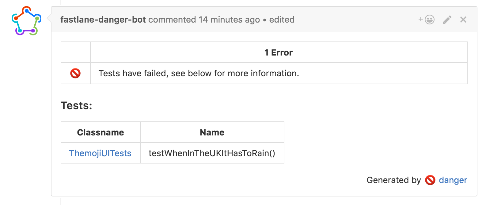

# trainer

[](https://twitter.com/KrauseFx)
[](https://github.com/KrauseFx/trainer/blob/master/LICENSE)
[](http://rubygems.org/gems/trainer)

This is an alternative approach to generate JUnit files for your CI (e.g. Jenkins) without parsing the `xcodebuild` output, but using the Xcode `plist` or `xcresult` files instead.

Some Xcode versions has a known issue around not properly closing `stdout` ([Radar](https://openradar.appspot.com/27447948)), so you [can't use xcpretty](https://github.com/supermarin/xcpretty/issues/227).

`trainer` is a more robust and faster approach to generate JUnit reports for your CI system. 

> By using `trainer`, the Twitter iOS code base now generates JUnit reports 10 times faster.

| | [xcpretty](https://github.com/supermarin/xcpretty) |  trainer
--------------------------|------------------------------|------------------------------
Prettify the `xcodebuild` output | :white_check_mark: | :no_entry_sign:
Generate JUnit reports | :white_check_mark: | :white_check_mark:
Generate HTML reports | :white_check_mark: | :no_entry_sign:
Works when the `xcodebuild` output format changed | :no_entry_sign: | :white_check_mark:
Show test execution duration | :white_check_mark: | :white_check_mark:
Speed | :car: | :rocket:

[xcpretty](https://github.com/supermarin/xcpretty) is a great piece of software that is used across all [fastlane tools](https://fastlane.tools). `trainer` was built to have the minimum code to generate JUnit reports for your CI system.

More information about the why `trainer` is useful can be found on [my blog](https://krausefx.com/blog/trainer-the-simplest-way-to-generate-a-junit-report-of-your-ios-tests).

## Use with [fastlane](https://fastlane.tools)

Update to the latest [fastlane](https://fastlane.tools) and run

```bash
fastlane add_plugin trainer
```

Now add the following to your `Fastfile`

```ruby
lane :test do
  scan(scheme: "ThemojiUITests", 
       output_types: "", 
       fail_build: false)

  trainer(output_directory: ".")
end
```

This will generate the JUnit file in the current directory. You can specify any path you want, just make sure to have it clean for every run so that your CI system knows which one to pick.

If you use circle, use the following to automatically publish the JUnit reports

```ruby
trainer(output_directory: ENV["CIRCLE_TEST_REPORTS"])
```

For more information, check out the [fastlane plugin docs](fastlane-plugin-trainer#readme).

## Without [fastlane](https://fastlane.tools)

### Installation

Add this to your `Gemfile` 
```
gem trainer
```
and run
```
bundle install
```

Alternatively you can install the gem system-wide using `sudo gem install trainer`.

### Usage

If you use `fastlane`, check out the official [fastlane plugin](fastlane-plugin-trainer#readme) on how to use `trainer` in `fastlane`.

#### Run tests

```
cd [project]
fastlane scan --derived_data_path "output_dir"
```

#### Convert the plist or xcresult files to junit

```
trainer
```

You can also pass a custom directory containing the plist or xcresult files

```
trainer --path ./something
```

For more information run

```
trainer --help
````

### Show the test results right in your pull request

To make it easier for you and your contributors to see the test failures, you can use [danger](http://danger.systems) with the [danger-junit](https://github.com/orta/danger-junit) plugin to automatically post the test failures on the GitHub PR. 



### Thanks

After the [lobbying of @steipete](https://twitter.com/steipete/status/753662170848690176) and the comment

> How does Xcode Server parse the results?

I started investigating alternative approaches on how to parse test results.

For more information about the plist files that are being used, check out [Michele's blog post](http://michele.io/test-logs-in-xcode).
